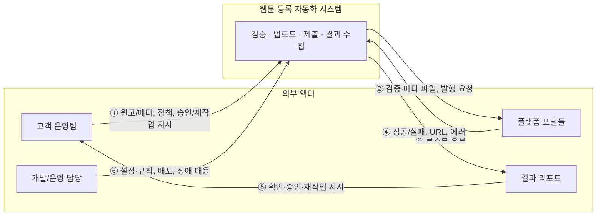

# 비즈니스 컨텍스트 다이어그램

## 1. 목적

- **시스템 경계**: 웹툰 등록 자동화가 "누구와 무엇을 주고받는지"를 한눈에 보기 위함.
- **이해관계자**: 고객·개발·운영이 동일한 맥락을 공유할 수 있도록 텍스트 기반으로 작성.

---

## 2. 다이어그램 (텍스트)

```
                    ┌─────────────────────────────────────────────────────────┐
                    │                   외부 액터 (External)                   │
                    └─────────────────────────────────────────────────────────┘

  ┌──────────────────────┐
  │   고객 운영팀         │
  │   (실무·의사결정)     │
  └──────────┬───────────┘
             │
             │ ① 원고/엑셀·메타, 운영 정책, 승인/재작업 지시
             ▼
  ┌──────────────────────────────────────────────────────────────────────────┐
  │                                                                          │
  │                    웹툰 등록 자동화 시스템                                │
  │                    (검증 · 업로드 · 제출 · 결과 수집)                     │
  │                                                                          │
  └──────────┬───────────────────────────────────────────┬───────────────────┘
             │                                           │
             │ ② 검증 요청, 메타·파일, 발행 요청           │ ④ 성공/실패 결과,
             ▼                                           │    상태·URL·에러
  ┌──────────────────────┐                    ┌─────────▼───────────────────┐
  │  플랫폼 포털들        │                    │   결과 리포트 / 알림          │
  │  (카카오·네이버·      │ ③ 로그인·메타·     │   (실행 이력, 실패 사유,     │
  │   레진·교보 등)       │    업로드·제출      │    재처리 대상)              │
  └──────────────────────┘                    └─────────┬───────────────────┘
             ▲                                           │
             │                                           │ ⑤ 확인·승인·재작업 지시
             │                                           ▼
             │                                ┌──────────────────────┐
             │                                │   고객 운영팀         │
             └────────────────────────────────│   (결과 확인·조치)   │
                    (플랫폼 응답)              └──────────────────────┘

  ┌──────────────────────┐
  │  개발/운영 담당       │
  │  (설정·모니터링)      │──── ⑥ 설정·규칙, 배포, 장애 대응 ────▶ [자동화 시스템]
  └──────────────────────┘
```

---

## 3. Mermaid 버전 (렌더링 가능 환경용)

GitHub·Notion 등에서 Mermaid를 지원하면 아래 코드로 동일 구조를 그림으로 볼 수 있습니다.



---

## 4. 액터 정의

| 액터 | 설명 | 시스템과의 관계 |
|------|------|-----------------|
| **고객 운영팀** | 웹툰을 다수 플랫폼에 등록하는 실무 담당·의사결정자 | 입력(원고·메타·정책) 제공, 결과 확인·승인·재작업 지시 |
| **플랫폼 포털들** | 카카오·네이버·레진·교보 등 웹툰 등록 포털 | 자동화 시스템이 로그인·메타 입력·업로드·제출을 수행하고, 성공/실패·URL 등을 반환 |
| **결과 리포트** | 실행 이력·실패 사유·재처리 대상 등이 담긴 산출물 | 자동화 시스템이 생성 → 고객이 확인·조치 |
| **개발/운영 담당** | 자동화 시스템을 설계·구현·운영하는 측 | 검증 규칙·설정·배포·장애 대응 |

---

## 5. 데이터 흐름 요약

| 흐름 | 방향 | 내용 |
|------|------|------|
| ① | 고객 → 시스템 | 원고·엑셀/메타, 운영 정책, 승인·재작업 지시 |
| ② | 시스템 → 플랫폼 | 로그인·세션, 메타 입력, 파일 업로드, 제출 요청 |
| ③ | 플랫폼 → 시스템 | 성공/실패, URL, 검증 오류, 상태 코드 |
| ④ | 시스템 → 결과 리포트 | 실행 이력, 성공/실패 건별 상세, 재시도·수동 전환 구분 |
| ⑤ | 결과 리포트 → 고객 | 확인·승인·재작업 지시 (사람의 판단·조치) |
| ⑥ | 개발/운영 → 시스템 | 검증 규칙·플랫폼별 설정·스케줄·배포·장애 대응 |

---

## 6. 관련 문서

| 문서 | 경로 |
|------|------|
| 프로젝트 개요·진행 방식 | [notion_page_1_project_overview.md](../../customer/notion_page_1_project_overview.md) |
| 실행 흐름·요구사항 | [notion_page_2_execution_flow_and_requirements.md](../../customer/notion_page_2_execution_flow_and_requirements.md) |
| 자동화 경계·결정 | [automation_boundary_and_decisions.md](../../asis/automation_boundary_and_decisions.md) |
| As-Is Flow | [flow_confirmation.md](../../asis/flow_confirmation.md) |
| 이해관계자 목록 | [stakeholder_list.md](stakeholder_list.md) |
