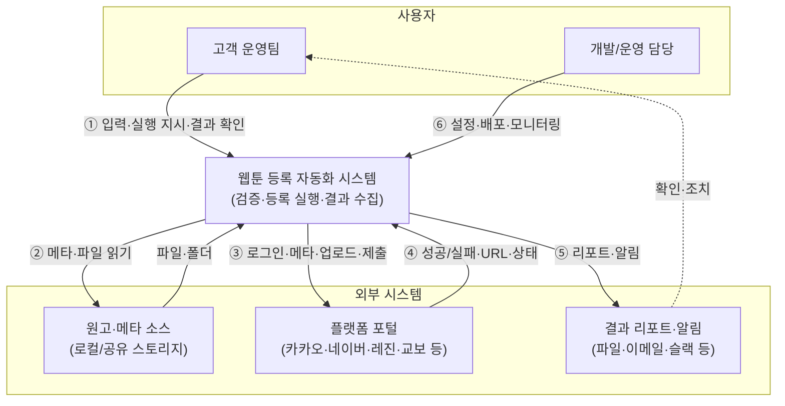

# 시스템 컨텍스트 다이어그램

## 1. 목적

- **시스템 경계**: 우리가 구축하는 **웹툰 등록 자동화 시스템**이 어떤 사용자·외부 시스템과 어떻게 연동하는지 기술 관점에서 표현.
- **비즈니스 컨텍스트와의 차이**: 비즈니스 컨텍스트는 “누가 무엇을 주고받는가”에 초점을 두고, 시스템 컨텍스트는 **하나의 소프트웨어 시스템**을 중심에 두고 사람·외부 시스템과의 상호작용을 그린다.

---

## 2. 다이어그램 (텍스트)

```
  ┌─────────────────────────────────────────────────────────────────────────────┐
  │                           사용자 (Users)                                      │
  └─────────────────────────────────────────────────────────────────────────────┘

  ┌──────────────────────┐                    ┌──────────────────────┐
  │   고객 운영팀         │                    │   개발/운영 담당       │
  │   (실무·의사결정)     │                    │   (설정·모니터링)     │
  └──────────┬───────────┘                    └──────────┬───────────┘
             │                                            │
             │ ① 원고·메타 입력, 실행 지시,               │ ⑥ 설정·규칙 배포,
             │    결과 확인·재작업 지시                    │    모니터링·장애 대응
             ▼                                            ▼
  ┌──────────────────────────────────────────────────────────────────────────────┐
  │                                                                               │
  │              웹툰 등록 자동화 시스템 (Webtoon Publishing Automation)          │
  │              · 사전 검증  · 플랫폼별 등록 실행  · 결과 수집·리포트             │
  │                                                                               │
  └──────────┬────────────────────────────┬──────────────────────────┬────────────┘
             │                            │                          │
             │ ② 메타·파일 읽기           │ ③ HTTP/브라우저 자동화   │ ④ 리포트·알림
             ▼                            │   (로그인·입력·업로드·   │    출력
  ┌──────────────────────┐                │    제출)                 ▼
  │  원고·메타 소스       │                │              ┌──────────────────────┐
  │  (로컬/공유 스토리지, │                │              │  결과 리포트·알림    │
  │   엑셀·폴더 구조)     │                │              │  (파일·이메일·슬랙 등)│
  └──────────────────────┘                │              └──────────────────────┘
             ▲                            ▼
             │                   ┌──────────────────────┐
             │                   │  플랫폼 포털         │
             │                   │  (카카오·네이버·      │
             │                   │   레진·교보 등)       │
             │                   │  · 웹 UI / 또는 API  │
             │                   └──────────┬───────────┘
             │                              │
             │ ⑤ 성공/실패·URL·상태         │
             └──────────────────────────────┘
```

---

## 3. Mermaid 버전 (렌더링 가능 환경용)



---

## 4. 요소 정의

### 4.1 중앙 시스템

| 요소 | 설명 |
|------|------|
| **웹툰 등록 자동화 시스템** | 우리가 구축·운영하는 소프트웨어. 사전 검증, 플랫폼별 등록 실행(웹 자동화 또는 API), 결과 수집·리포트 생성 담당. |

### 4.2 사용자 (Users)

| 사용자 | 시스템과의 상호작용 |
|--------|---------------------|
| **고객 운영팀** | 원고·메타 입력(또는 입력 소스 지정), 실행 지시, 결과 확인·재작업 지시. UI·리포트·알림을 통해 시스템과 소통. |
| **개발/운영 담당** | 검증 규칙·플랫폼별 설정·스케줄 배포, 모니터링·장애 대응. 설정·배포·운영 도구를 통해 시스템과 소통. |

### 4.3 외부 시스템 (External Systems)

| 외부 시스템 | 설명 | 시스템과의 연동 방식 |
|-------------|------|----------------------|
| **원고·메타 소스** | 원고 파일·메타데이터(엑셀 등)가 있는 로컬/공유 스토리지·폴더 구조 | 파일 시스템 접근, 메타 파일 파싱 |
| **플랫폼 포털** | 카카오·네이버·레진·교보 등 웹툰 등록 포털 | HTTP, 브라우저 자동화(또는 공식 API 존재 시 API) |
| **결과 리포트·알림** | 실행 이력·실패 사유를 전달하는 채널(파일, 이메일, 슬랙 등) | 파일 출력, 이메일/Slack 등 연동 |

---

## 5. 상호작용 요약

| # | 방향 | 내용 | 비고 |
|---|------|------|------|
| ① | 고객 운영팀 → 시스템 | 원고·메타 위치 지정, 실행 지시, 결과 확인·재작업 지시 | UI·리포트 |
| ② | 시스템 ↔ 원고·메타 소스 | 메타·파일 읽기(폴더/엑셀 등) | 파일·스토리지 |
| ③ | 시스템 → 플랫폼 포털 | 로그인·메타 입력·파일 업로드·제출 요청 | HTTP/브라우저 자동화 또는 API |
| ④ | 플랫폼 포털 → 시스템 | 성공/실패, URL, 검증 오류, 상태 코드 | 응답·화면 파싱 |
| ⑤ | 시스템 → 결과 리포트·알림 | 실행 이력, 건별 결과, 실패 사유, 재처리 대상 | 파일·이메일·슬랙 등 |
| ⑥ | 개발/운영 담당 → 시스템 | 설정·규칙·배포, 모니터링·장애 대응 | 설정·운영 도구 |

---

## 6. 관련 문서

| 문서 | 설명 |
|------|------|
| [비즈니스 컨텍스트 다이어그램](../overview/business_context_diagram.md) | 비즈니스 관점의 액터·데이터 흐름 |
| [stakeholder_list.md](../overview/stakeholder_list.md) | 이해관계자 목록 |
| [notion_page_1_project_overview.md](../../customer/notion_page_1_project_overview.md) | 프로젝트 진행 방식 |
| [system_feature_list.md](system_feature_list.md) | **시스템 기능 목록** (다음 페이지) |
