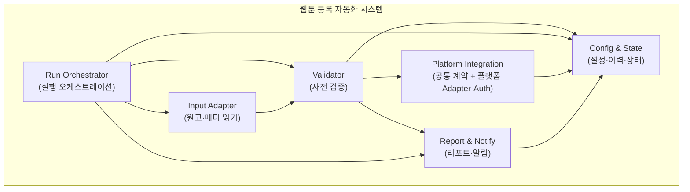

# Structure View (구조 뷰)

## 1. 목적
웹툰 등록 자동화 **시스템 내부의 최상위 구조**를 표현합니다. 시스템 컨텍스트에서 하나의 블록으로 보이던 "웹툰 등록 자동화 시스템"을 **주요 구성 요소(서브시스템/모듈)**로 나누고, 그 사이의 의존·연동 관계를 그립니다.  
품질 속성(변경용이성)에 따라 플랫폼 연동·인증을 분리하고, **플랫폼 웹 요소 ID 변경 시 고객 운영팀이 변경된 ID를 직접 수정·등록할 수 있도록** Config & State에 요소 ID 맵핑을 두며, Platform Integration은 이 맵핑을 읽어 사용하는 구조를 반영합니다.

---

## 2. 구조 다이어그램 (텍스트)

화살표: 호출·데이터 전달 방향 (A → B = A가 B를 호출하거나 A에서 B로 전달)

```
  [고객/스케줄] ──실행 지시──▶ Run Orchestrator
                                    │
                    ┌───────────────┼───────────────────────┐
                    ▼               ▼                       ▼
              Input Adapter    Config & State         Report & Notify
                    │               ▲               │
                    │               │               │
                    ▼               │               ▼
              Validator ──규칙 읽기─┘         Report & Notify ──▶ [외부: 리포트·알림]
                    │               ▲               ▲
                    │ 실패 시 반영  │               │ 결과 읽기
                    └──────────────┼───────────────┘
                    ▼               │
              Platform Integration  │ 결과 저장
                    │               │
                    └───────────────┘
                    │
                    └──▶ [외부: 플랫폼 포털]

  Input Adapter ──읽기──▶ [외부: 원고·메타 소스]
```

**컴포넌트 간 화살표 요약** (§5 주요 흐름과 일치. 검토 반영: Validator→Config, Validator→Report 추가.)

| From | To | 의미 |
|------|-----|------|
| Orchestrator | Input | 소스·대상 지정, 읽기 트리거 |
| Orchestrator | Validator | 검증 단계 트리거 |
| Orchestrator | Config | 설정 조회, 이력 저장 |
| Orchestrator | Report | 결과 리포트 생성 지시 |
| Input | Validator | 메타·파일 목록 전달 |
| Validator | Platform | 검증 통과 시 등록 실행으로 전달 |
| Validator | Config | 검증 규칙 읽기 |
| Validator | Report | 검증 실패 시 반영 |
| Platform | Config | 실행 이력·건별 상태 저장 |
| Report | Config | 리포트 생성 시 결과·이력 읽기 |

---

## 3. Mermaid 버전 (렌더링 가능 환경용)



- **실행 흐름**: Orchestrator → Input → Validator → Platform  
- **Config**: Orchestrator(조회/저장), Validator(규칙 읽기), Platform(결과 저장), Report(결과 읽기)  
- **Validator → Report**: 검증 실패 시 Report에 반영

---

## 4. 구성 요소 정의

| ID | 구성 요소 | 책임 | 비고 |
|----|-----------|------|------|
| **Run Orchestrator** | 실행 흐름의 진입·조율. 사용자/스케줄의 실행 지시를 받아 소스·대상(작품·회차·플랫폼)을 정하고, Input → Validator → Platform 순으로 단계를 진행하며, 결과를 Report·Config에 반영한다. | 오케스트레이션만 담당, 플랫폼별 로직 없음 |
| **Input Adapter** | 원고·메타 소스(로컬/공유 경로·엑셀 등)에서 메타데이터와 원고 파일 목록을 읽어 공통 형식으로 제공한다. | 외부: 원고·메타 소스 |
| **Validator** | 업로드 전 사전 검증. 메타 누락·형식·파일 규격을 검사하고, 검증 규칙은 Config에서 조회한다. | 검증 규칙은 설정으로 변경 가능 |
| **Platform Integration** | 플랫폼별 등록 실행의 공통 계약(인터페이스)과, 플랫폼별 **Adapter**(웹 UI/API 연동)·**Auth**(로그인·세션) 구현을 담는다. Adapter는 플랫폼 웹 요소 탐색 시 **Config & State의 요소 ID(셀렉터) 맵핑**을 읽어 사용하므로, **요소 ID 변경 시 고객 운영팀이 맵핑만 수정**하면 된다. 로직·플로우 변경 시에는 해당 Adapter/Auth 수정·추가. | 변경용이성: 플러그인/어댑터·맵핑 분리 |
| **Config & State** | 플랫폼별 설정·검증 규칙·재시도 정책·**계정 정보**(아이디·비밀번호·API 키 등, 보안 저장 연동)·**요소 ID(셀렉터) 맵핑**·실행 이력·상태 저장. 다른 요소가 설정·이력을 읽고 쓴다. **고객 운영팀**이 설정 UI에서 (1) 플랫폼 로그인 비밀번호 등 자격 정보 **값**, (2) **플랫폼 웹 요소 ID(셀렉터) 맵핑**을 직접 등록·수정할 수 있어, 비밀번호 변경·요소 ID 변경 시 개발자 수정 없이 사용자 입장에서 대응 가능하다. | 설정·이력·맵핑의 단일 개념적 저장소 |
| **Report & Notify** | 실행 결과·실패 사유·재처리 구분을 리포트로 생성하고, 파일·이메일·슬랙 등 설정된 채널로 알림을 보낸다. | 외부: 결과 리포트·알림 채널 |

---

## 5. 주요 흐름 (실행 1회)

1. **Run Orchestrator**: 실행 지시 수신 → 대상(소스 경로·작품·회차·플랫폼) 결정 → Config에서 설정 조회.
2. **Input Adapter**: 지정된 소스에서 메타·파일 목록 읽기.
3. **Validator**: 메타·파일 규격 검증(Config의 규칙 사용). 실패 시 Report에 반영 후 종료 또는 재시도 정책에 따름.
4. **Platform Integration**: 플랫폼별 Adapter·Auth로 로그인 → 메타 입력 → 업로드 → 제출. 결과(성공/실패·URL·에러) 수집.
5. **Config & State**: 실행 이력·건별 상태 저장.
6. **Report & Notify**: 결과 리포트 생성·알림 전송.

---

## 6. 품질 속성 반영
- **변경용이성**: Platform Integration 내부가 공통 계약 + 플랫폼별 Adapter·Auth로 분리되어 있어, 웹 UI 변경·로그인 방식 변경·플랫폼 추가 시 해당 구현만 수정·추가.
- **설정·규칙**: Validator·Platform·Report가 Config & State를 참조하여 동작하므로, 코드 수정 없이 설정만으로 조정 가능한 범위 확보.

---

## 7. 변경 시나리오: 로그인 방식 변경

현재 뷰 기준으로, **대상 플랫폼의 로그인 방식**(예: ID/비밀번호 → OAuth, 2단계 인증 추가, 캡차 도입)이 바뀌었을 때 **어디만 수정되면 되는지** 정리합니다.

### 7.1 수정 대상이 되는 부분

| 수정 대상 | 위치 | 수정 내용 |
|-----------|------|-----------|
| **플랫폼별 Auth 구현** | **Platform Integration** 내부의 **Auth** | 해당 플랫폼의 로그인·세션 확보 방식만 구현한 **Auth 모듈(또는 전략)**을 **추가**하거나 **기존 구현을 교체**한다. 예: `PlatformA_IdPwAuth` → `PlatformA_OAuthAuth` 로 교체, 또는 2FA 대응 구현 추가. |

**다른 구성 요소는 수정하지 않는다.**  
Run Orchestrator, Input Adapter, Validator, Report & Notify, Config & State, 그리고 Platform Integration 안의 **등록 실행**(메타 입력·업로드·제출) 흐름은 그대로 둔다. Orchestrator는 “유효한 세션/토큰을 넘겨받아 다음 단계로 넘긴다”는 계약만 알고, **어떤 방식으로 세션을 얻었는지는 모른다**.

### 7.2 Platform Integration 내부 관점 (로그인만 분리)

```
  Platform Integration
  ┌─────────────────────────────────────────────────────────────────┐
  │  공통 계약 (인터페이스)                                           │
  │  · ensureSession(platform, credentials) → Session | Error        │
  │  · submitMeta(session, meta), uploadFiles(...), submit(...) ...  │
  └─────────────────────────────────────────────────────────────────┘
           │                              │
           ▼                              ▼
  ┌─────────────────────┐      ┌─────────────────────┐
  │  플랫폼 A Adapter    │      │  플랫폼 B Adapter    │  ...
  │  · Auth (로그인만)   │      │  · Auth (로그인만)   │
  │    - IdPwAuth        │      │    - OAuthAuth       │
  │    - OAuthAuth (신규)│      │    - IdPwAuth        │
  │  · 메타·업로드·제출  │      │  · 메타·업로드·제출  │
  └─────────────────────┘      └─────────────────────┘
```

로그인 방식이 바뀌면 **해당 플랫폼의 Auth 구현체만** 추가·교체한다.  
공통 계약(예: `ensureSession` 이 “유효한 세션/토큰”을 반환)은 유지하고, 계정·비밀번호·토큰 등 자격 정보는 Config & State(또는 보안 저장소)에서 주입받도록 하면, 로그인 방식 변경이 **한 플랫폼의 Auth 블록 안**으로만 한정된다.

### 7.3 요약

| 질문 | 답변 |
|------|------|
| 최상위 뷰에서 바뀌는 요소가 있나? | **없다.** Run Orchestrator, Input, Validator, Config, Report는 그대로다. |
| 실제로 수정하는 곳은? | **Platform Integration** 안의, 해당 플랫폼용 **Auth** 구현만 추가·교체. |
| 공통 계약은? | “세션/토큰 확보” 인터페이스는 그대로 두고, 새 로그인 방식에 맞는 구현체를 붙인다. |
| 설정 변경이 필요한가? | 로그인 방식에 따라 **Config & State**의 자격 정보(예: OAuth client id/secret, 리다이렉트 URL) 스키마·값만 추가·갱신할 수 있다. 코드 구조는 그대로. |

### 7.4 비밀번호(값)만 변경되는 경우 — 개발자 없이 고객 운영팀이 대응

**로그인 방식**이 바뀌는 것(예: ID/PW → OAuth)과 **비밀번호 값**만 바뀌는 것은 구분한다.

| 구분 | 로그인 방식 변경 | 비밀번호(값)만 변경 |
|------|------------------|---------------------|
| 예시 | ID/PW → OAuth, 2단계 인증 추가 | 동일 ID/PW 방식인데 비밀번호만 변경 |
| 대응 주체 | 개발 담당(Auth 구현 추가·교체) | **고객 운영팀** |
| 수정 범위 | Platform Integration 내 Auth 구현체 | **없음(코드 수정 없음)** |
| 조치 | 새 Auth 모듈 배포 | **Config & State**에 저장된 해당 플랫폼 로그인 **비밀번호(값)**를 고객 운영팀이 **설정 UI**에서 직접 변경·입력 |

**뷰에서의 반영**

- **Config & State**에 플랫폼별 자격 정보(아이디·비밀번호·API 키 등)가 저장되며, 이 **값**은 **고객 운영팀**이 **설정 화면(또는 관리 UI)**에서 수정·입력할 수 있도록 한다.
- **Platform Integration**의 Auth는 실행 시 Config & State(또는 보안 저장소)에서 자격 정보를 **읽어서** 로그인만 수행한다. 따라서 비밀번호 값만 바꾸면 다음 실행부터 새 비밀번호로 동작하고, **배포나 코드 변경은 필요 없다.**

이렇게 하면 비밀번호 변경에 대해 **사용자(고객 운영팀) 입장에서 개발자 개입 없이** 설정 변경만으로 대응할 수 있다.

---

## 8. 변경 시나리오: 플랫폼 웹 인터페이스(UI)·요소 ID 변경

대상 플랫폼의 **웹 인터페이스**(URL·폼·버튼·DOM) 또는 **요소 ID(셀렉터)**가 변경되었을 때의 수정 주체와 **요소 ID 맵핑** 요구사항을 정의합니다.

### 8.1 요소 ID(셀렉터) 변경 — 고객 운영팀이 직접 수정

| 구분 | 내용 |
|------|------|
| **요구사항** | 등록 대상 **플랫폼 웹의 각 요소 ID가 변경**되어도 **고객 운영팀**이 **변경된 요소 ID를 수정**하여 시스템을 수정할 수 있도록 한다. (개발자 수정·배포 없이 사용자 입장에서 대응.) |
| **수단** | **요소 ID 맵핑** 데이터를 **사용자(고객 운영팀)가 등록·수정할 수 있는 인터페이스**를 둔다. 각 데이터(등록 대상 요소)별 **ID 맵핑 정보**는 **개발자가 아닌 사용자 입장에서 등록** 가능한 구조·UI로 한다. |
| **데이터·구조** | 맵핑 데이터 구조는 사용자 편집에 맞게 정의하며, Platform Integration(Adapter)은 이 맵핑을 Config & State(또는 전용 저장소)에서 읽어 사용한다. 상세는 [element_id_mapping.md](../system_overview/element_id_mapping.md) 참고. |
| **Config & State** | 요소 ID 맵핑은 Config & State(또는 전용 저장소)에 저장하며, 고객 운영팀 전용 **맵핑 등록·수정 UI**를 통해 편집한다. |

### 8.2 그 외 인터페이스 변경(로직·플로우 등) — 개발팀 수정

| 구분 | 내용 |
|------|------|
| **수정 주체** | **요소 ID가 아닌** 인터페이스 변경(예: 단계 순서 변경, 새 단계 추가, 로직 변경)은 **개발팀이 시스템을 수정**하는 것으로 정의한다. |
| **고객 역할** | 변경 인지·반영 요청·우선순위 제안·검수. (요청은 고객, 구현은 개발팀.) |

---

## 9. 관련 문서
| 문서 | 설명 |
|------|------|
| [system_context_diagram.md](../system_overview/system_context_diagram.md) | 시스템 컨텍스트 (이 구조가 하나의 시스템으로 보이는 뷰) |
| [element_id_mapping.md](../system_overview/element_id_mapping.md) | 요소 ID 맵핑 (요구사항·데이터 구조·사용자 인터페이스) |
| [quality_attributes.md](../architecture_driver/quality_attributes.md) | 변경용이성(인터페이스·로그인 방식 변경 대응 등) 품질 속성 |
| [system_feature_list.md](../system_overview/system_feature_list.md) | 시스템 기능 목록 |
| [stakeholder_list.md](../overview/stakeholder_list.md) | 플랫폼 웹 변경 시 반영 요청·수정 주체 정의 |
